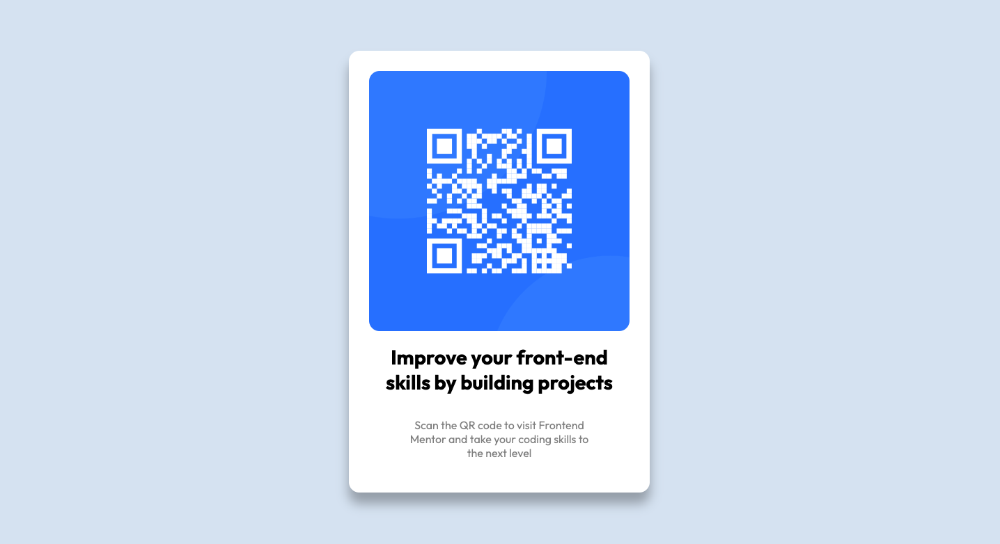

# qr-code-challenge

QR code challenge on frontend mentors

# Frontend Mentor - QR code component solution

This is a solution to the [QR code component challenge on Frontend Mentor](https://www.frontendmentor.io/challenges/qr-code-component-iux_sIO_H).

## Table of contents

- [Overview](#overview)
  - [Screenshot](#screenshot)
  - [Links](#links)
- [My process](#my-process)
- [What I learned](#what-i-learned)
- [Acknowledgments](#acknowledgments)

**Note: Delete this note and update the table of contents based on what sections you keep.**

## Overview

First challenge for me of this type trying to improve my basic HTML & CSS skills. I am happy with the end result for the desktop view and have tried where possible to use percentages or em / rem for sizes in order for the page to be responsive. I haven't learned about media queries yet so I haven't been able to adapt the page to mobile in a way that looks clean.

## Screenshot

## links

Link to the challenge: https://www.frontendmentor.io/challenges/qr-code-component-iux_sIO_H

## my-process

1. Studied the design photos (don't have access to the Figma files)
2. Draw a sketch to visualise how the containers are going to work with flexbox
3. write out the HTML
4. implement the styles with CSS

## what-i-learned

1. Refreshed on how to use flexbox effectively
2. I learned how box shadows work
3. Centering items
4. How to try to incorporate % and em / rem for sizes.
5. Attempted my first media query.

## acknowledgements

frontendmentor.io for the challenge.
